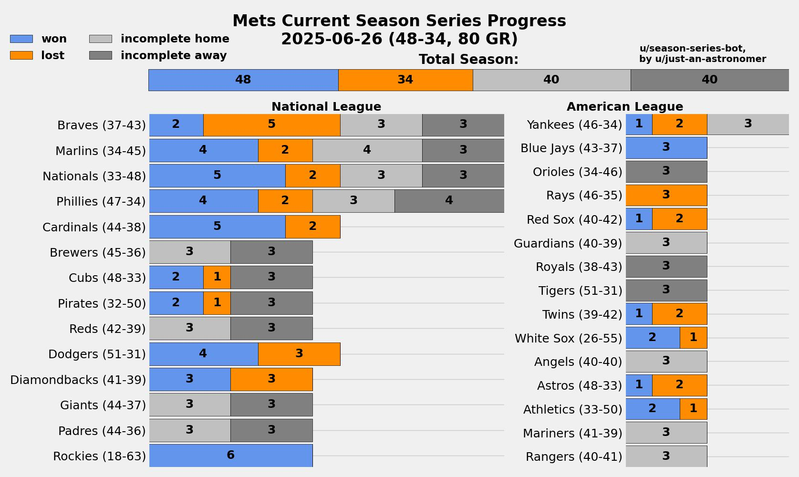

# season-series-bot
A bot that creates a jpg image of stacked bar graph of an MLB team using `MLB-StatsAPI`, `pandas`, and `matplotlib`. Currently set to the New York Mets but can be tweaked to cover any MLB team. To use the bot functionality, you must provide your own bot credentials and store them in a file called `credentials.txt`.

Example:
